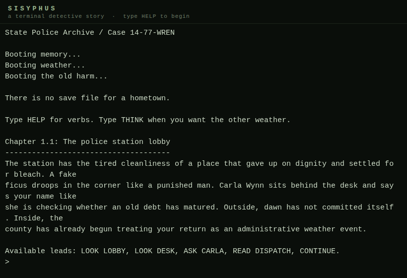
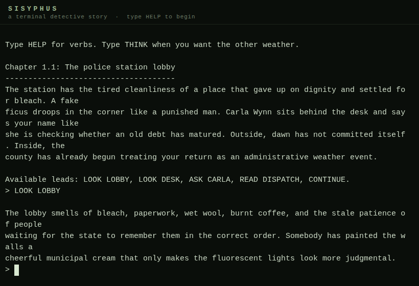

# SISYPHUS

A command-line detective story.

You are Jonah Mercer, a state investigator sent back to his dying hometown to examine the murder of a prominent family. What begins as a routine case becomes a descent through memory, family debt, and the violence that small towns bury under procedure.

The game is text-only, played entirely through typed commands in a terminal. There are no graphics, no sound, and no hand-holding. You read, you choose, and the story remembers.

## Requirements

- Python 3.10 or later
- No third-party dependencies

## Play in the browser

A browser build of the game runs entirely client-side — no server, no network calls.
The original Python is executed by [Pyodide](https://pyodide.org) (Python compiled
to WebAssembly); the terminal is [xterm.js](https://xtermjs.org).





To build the web bundle yourself:

```bash
cd web
python3 build.py            # generates sisyphus_web.py from the original game
# serve the web/ directory with any static server and open index.html
```

`build.py` only rewrites I/O plumbing (`input()`/`print()`) into async bridges;
the game logic itself is transformed with zero semantic changes (verified by
automated playthroughs of all 19 scenes and all 4 endings).

## Running

```bash
python3 sisyphus_game.py
```

## Commands

| Command | Purpose |
|---|---|
| `LOOK <thing>` | Inspect rooms, objects, gestures |
| `ASK <person>` | Press a witness or memory |
| `READ <thing>` | Examine a notebook, file, memo, or note |
| `CALL <person>` | Reach outside the room when possible |
| `DRINK <thing>` | Accept local anesthesia |
| `HOLD <thing>` | Keep paper, truth, or nerve in your own hands |
| `THINK` | Hear the internal voices |
| `STATUS` | Inspect COURAGE / LUCIDITY / REASON |
| `CONTINUE` | Leave the current scene once enough has been faced |
| `HELP` | Show the command list |
| `QUIT` | Leave the game |

Commands are case-insensitive. Each scene offers a set of available interactions shown in its hint line. You must complete the required interactions before you can `CONTINUE` to the next scene.

## Structure

The game is divided into 7 chapters and an ending sequence, set in the fictional town of Saint Barrow, Pennsylvania.

1. **Return to Saint Barrow** — The police station and Chief Bell's office
2. **The Wren House** — Crime scene investigation
3. **The Mother House** — Evelyn, the kitchen, Gabriel's room
4. **The Records Nobody Keeps** — Hospital files, county archive, a phone call from the city
5. **Chief Bell at Night** — The bar, off-book files, a choice about evidence
6. **The Brothers in the Hollow** — Gabriel's confession
7. **The Buried Field** — Evelyn's final testimony, hidden evidence

## Endings

There are four endings. Which one you reach depends on the choices you make across the entire game — not just the final scene.

- **Ending A** — The lawful betrayal
- **Ending B** — The family silence
- **Ending C** — The blood inheritance
- **Hidden Ending** — The first murderer

The game tracks three hidden attributes — COURAGE, LUCIDITY, and REASON — along with several boolean flags and counters. These shift based on what you read, who you press, and whether you drink. The ending is determined by the accumulated state, not by any single choice.

## Design Notes

- Most choices reconverge. Their function is to tint a scene, alter internal variables, and decide what kind of person Jonah is becoming.
- Drinking lowers LUCIDITY. Sustained low LUCIDITY unlocks content that is otherwise inaccessible — and closes other paths permanently.
- The THINK command reveals different voices depending on your current state. At low LUCIDITY, the voices become unreliable.
- There is no save system. The game is designed to be played in one sitting.

## Testing

```bash
python3 -m unittest discover -s tests -v
```

## License

This project is provided as-is for personal and educational use.
